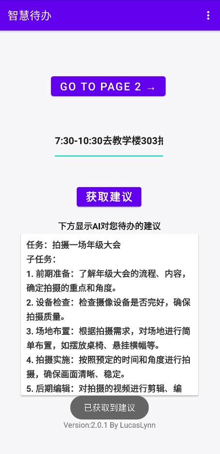

# Smart Todo App

> ✏️作者：FormerOR（别名LucasLynn） 更新日期：2024年6月19日00:20:26
>
> 📝智慧待办，一款安卓应用，目标是在用户输入待办事项后，能通过AI分析来规划日程和事项安排，基于java开发
>
> 开发动机是NJUPT的Java程序设计课程大作业，老师给了几个选择，前几个都是清一色老掉牙的系统或者游戏，但最后两个分别是用Java开发安卓应用或者鸿蒙应用，然后觉得系统什么的也太无聊了，直接去CSDN都不用Chat出手，就打算自学一下安卓
> 正好@feipiao594 他想做一个跨平台的Todolist，我就顺着他的思路想，发挥自己在AI上略知一二能力的优势，结合当下很火的NLP，做一个API调用来实现AI分析功能

## 应用截图

